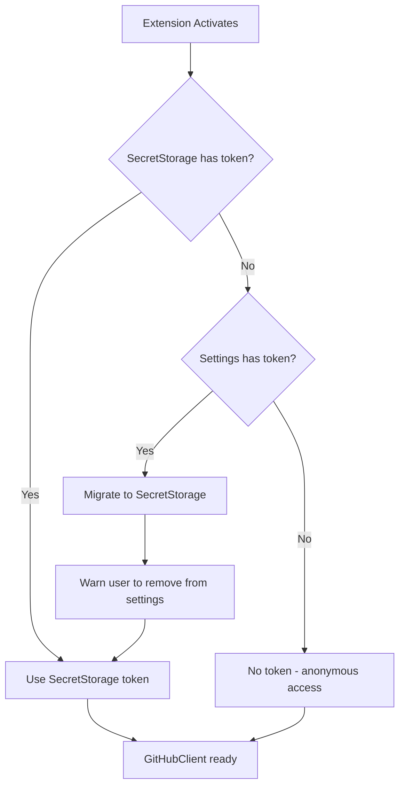
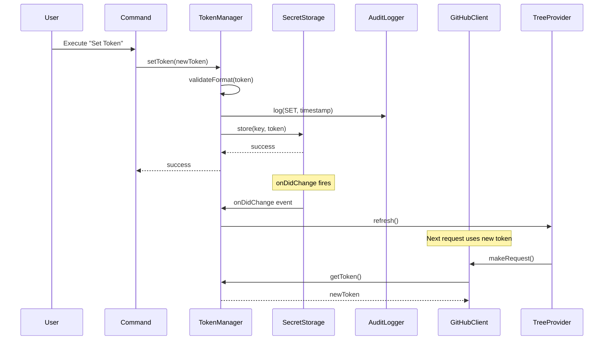

# Design Document: Enterprise Secure Token Storage

## Overview

This design describes the migration of GitHub token storage from plaintext settings to the secure SecretStorage API. The implementation introduces a new `TokenManager` service that handles secure storage, migration, validation, and audit logging while maintaining backward compatibility with existing configurations.

The design follows the existing service layer pattern in the extension, with `TokenManager` becoming the single source of truth for token operations. The `GitHubClient` is modified to accept a token provider function instead of a static token, enabling dynamic token updates without service recreation.

## Architecture

### High-Level Architecture

```
┌─────────────────────────────────────────────────────────────────┐
│                        Kiro IDE Extension                        │
├─────────────────────────────────────────────────────────────────┤
│                                                                  │
│  ┌──────────────┐    ┌──────────────┐    ┌──────────────────┐  │
│  │   Commands   │───▶│ TokenManager │───▶│  SecretStorage   │  │
│  │  (set/clear/ │    │              │    │  (OS Credential  │  │
│  │   status)    │    │              │    │    Manager)      │  │
│  └──────────────┘    └──────┬───────┘    └──────────────────┘  │
│                             │                                    │
│                             │ getToken()                         │
│                             ▼                                    │
│  ┌──────────────┐    ┌──────────────┐    ┌──────────────────┐  │
│  │ TreeProvider │───▶│ GitHubClient │───▶│   GitHub API     │  │
│  │              │    │ (uses token  │    │                  │  │
│  │              │    │  provider)   │    │                  │  │
│  └──────────────┘    └──────────────┘    └──────────────────┘  │
│                                                                  │
│  ┌──────────────┐    ┌──────────────┐                          │
│  │ AuditLogger  │◀───│ TokenManager │                          │
│  │ (Output      │    │ (logs ops)   │                          │
│  │  Channel)    │    │              │                          │
│  └──────────────┘    └──────────────┘                          │
│                                                                  │
└─────────────────────────────────────────────────────────────────┘
```

### Token Resolution Flow



### Token Change Event Flow



## Components and Interfaces

### TokenManager Service

The central service for all token operations. Handles storage, retrieval, migration, and validation.

```typescript
// src/services/TokenManager.ts

import * as vscode from 'vscode';

import { AuditLogger, AuditOperation } from './AuditLogger';

import type { TokenValidationResult, TokenInfo } from '../models/types';

export class TokenManager {
    private static readonly SECRET_KEY = 'steeringDocs.githubToken';
    private static readonly LEGACY_SETTING = 'githubToken';
    private static readonly MIGRATION_SHOWN_KEY = 'steeringDocs.migrationNoticeShown';
    
    private readonly onTokenChangeEmitter = new vscode.EventEmitter<void>();
    public readonly onTokenChange = this.onTokenChangeEmitter.event;
    
    constructor(
        private readonly secrets: vscode.SecretStorage,
        private readonly config: vscode.WorkspaceConfiguration,
        private readonly auditLogger: AuditLogger,
        private readonly globalState: vscode.Memento
    ) {
        // Listen for SecretStorage changes
        this.secrets.onDidChange((e) => {
            if (e.key === TokenManager.SECRET_KEY) {
                this.onTokenChangeEmitter.fire();
            }
        });
    }
    
    /**
     * Get the current token, handling migration from legacy settings
     */
    async getToken(): Promise<string | undefined> {
        // Implementation details in Data Models section
    }
    
    /**
     * Store a new token after validation
     */
    async setToken(token: string): Promise<TokenValidationResult> {
        // Implementation details in Data Models section
    }
    
    /**
     * Remove the stored token
     */
    async clearToken(): Promise<void> {
        // Implementation details in Data Models section
    }
    
    /**
     * Check token status and optionally validate against GitHub API
     */
    async checkTokenStatus(validateWithApi?: boolean): Promise<TokenInfo> {
        // Implementation details in Data Models section
    }
    
    /**
     * Validate token format without storing
     */
    validateTokenFormat(token: string): TokenValidationResult {
        // Implementation details in Data Models section
    }
    
    /**
     * Dispose of resources
     */
    dispose(): void {
        this.onTokenChangeEmitter.dispose();
    }
}
```

### AuditLogger Service

Logs security-relevant operations to a dedicated output channel for ISO compliance.

```typescript
// src/services/AuditLogger.ts

import * as vscode from 'vscode';

export enum AuditOperation {
    SET = 'SET',
    CLEAR = 'CLEAR',
    MIGRATE = 'MIGRATE',
    ACCESS = 'ACCESS',
    VALIDATE = 'VALIDATE',
    VALIDATE_FAILED = 'VALIDATE_FAILED'
}

export interface AuditLogEntry {
    timestamp: string;
    operation: AuditOperation;
    success: boolean;
    details?: string;
}

export class AuditLogger {
    private readonly outputChannel: vscode.OutputChannel;
    
    constructor() {
        this.outputChannel = vscode.window.createOutputChannel(
            'Steering Docs Security Audit'
        );
    }
    
    /**
     * Log a token operation
     */
    log(operation: AuditOperation, success: boolean, details?: string): void {
        const entry: AuditLogEntry = {
            timestamp: new Date().toISOString(),
            operation,
            success,
            details
        };
        
        const message = this.formatLogEntry(entry);
        this.outputChannel.appendLine(message);
    }
    
    /**
     * Format a log entry for output
     */
    private formatLogEntry(entry: AuditLogEntry): string {
        const status = entry.success ? 'SUCCESS' : 'FAILED';
        const details = entry.details ? ` - ${entry.details}` : '';
        return `[${entry.timestamp}] ${entry.operation} ${status}${details}`;
    }
    
    /**
     * Show the audit log output channel
     */
    show(): void {
        this.outputChannel.show();
    }
    
    /**
     * Dispose of resources
     */
    dispose(): void {
        this.outputChannel.dispose();
    }
}
```

### Modified GitHubClient

Updated to accept a token provider function instead of a static token.

```typescript
// src/services/GitHubClient.ts (modifications)

export type TokenProvider = () => Promise<string | undefined>;

export class GitHubClient {
    constructor(
        private readonly repository: string,
        private readonly branch: string = 'main',
        private readonly getToken: TokenProvider
    ) {}
    
    // In makeRequest method:
    private async makeRequest(url: string): Promise<unknown> {
        const headers: Record<string, string> = {
            'User-Agent': 'VSCode-Steering-Docs-Browser',
            'Accept': 'application/vnd.github.v3+json'
        };

        // Get token dynamically for each request
        const token = await this.getToken();
        if (token) {
            headers['Authorization'] = `Bearer ${token}`;
        }
        
        // ... rest of implementation
    }
}
```

### Token Management Commands

New commands for secure token management.

```typescript
// src/commands/tokenCommands.ts

import * as vscode from 'vscode';

import { TokenManager } from '../services/TokenManager';
import { SteeringDocsTreeProvider } from '../providers/SteeringDocsTreeProvider';

/**
 * Handle "Set GitHub Token" command
 */
export async function handleSetToken(
    tokenManager: TokenManager,
    treeProvider: SteeringDocsTreeProvider
): Promise<void> {
    // Show scope guidance before prompting for token
    const scopeInfo = await vscode.window.showInformationMessage(
        'GitHub Token Scopes:\n' +
        '• Public repos: No scopes required\n' +
        '• Private repos: "repo" scope required\n\n' +
        'Generate a token at: GitHub Settings → Developer settings → Personal access tokens',
        'Continue',
        'Open GitHub'
    );
    
    if (scopeInfo === 'Open GitHub') {
        vscode.env.openExternal(vscode.Uri.parse('https://github.com/settings/tokens'));
        return;
    }
    
    if (scopeInfo !== 'Continue') {
        return; // User cancelled
    }
    
    const token = await vscode.window.showInputBox({
        prompt: 'Enter your GitHub Personal Access Token',
        placeHolder: 'ghp_xxxx or github_pat_xxxx',
        password: true,
        ignoreFocusOut: true,
        validateInput: (value) => {
            if (!value || value.trim().length === 0) {
                return 'Token cannot be empty';
            }
            const result = tokenManager.validateTokenFormat(value);
            return result.valid ? null : result.error;
        }
    });
    
    if (!token) {
        return; // User cancelled
    }
    
    const result = await tokenManager.setToken(token);
    
    if (result.valid) {
        vscode.window.showInformationMessage(
            'GitHub token saved securely. You now have authenticated API access.'
        );
        treeProvider.refresh();
    } else {
        vscode.window.showErrorMessage(`Failed to save token: ${result.error}`);
    }
}

/**
 * Handle "Clear GitHub Token" command
 */
export async function handleClearToken(
    tokenManager: TokenManager,
    treeProvider: SteeringDocsTreeProvider
): Promise<void> {
    const confirm = await vscode.window.showWarningMessage(
        'Are you sure you want to clear your GitHub token? You will lose authenticated API access.',
        { modal: true },
        'Clear Token'
    );
    
    if (confirm !== 'Clear Token') {
        return;
    }
    
    await tokenManager.clearToken();
    vscode.window.showInformationMessage('GitHub token cleared.');
    treeProvider.refresh();
}

/**
 * Handle "Check Token Status" command
 */
export async function handleCheckTokenStatus(
    tokenManager: TokenManager
): Promise<void> {
    const status = await vscode.window.withProgress(
        {
            location: vscode.ProgressLocation.Notification,
            title: 'Checking token status...',
            cancellable: false
        },
        async () => {
            return await tokenManager.checkTokenStatus(true);
        }
    );
    
    if (!status.hasToken) {
        vscode.window.showInformationMessage(
            'No GitHub token configured. Using anonymous access (60 requests/hour).'
        );
        return;
    }
    
    if (status.isValid) {
        const rateInfo = status.rateLimit 
            ? ` Rate limit: ${status.rateLimit.remaining}/${status.rateLimit.limit}`
            : '';
        vscode.window.showInformationMessage(
            `Token valid. Authenticated as: ${status.username}${rateInfo}`
        );
    } else {
        vscode.window.showErrorMessage(
            `Token validation failed: ${status.error}`
        );
    }
}
```

## Data Models

### Token Types and Interfaces

```typescript
// src/models/types.ts (additions)

/**
 * Result of token format validation
 */
export interface TokenValidationResult {
    valid: boolean;
    error?: string;
    tokenType?: TokenType;
}

/**
 * Supported GitHub token types
 */
export enum TokenType {
    FINE_GRAINED = 'fine-grained',
    CLASSIC = 'classic',
    OAUTH = 'oauth',
    GITHUB_ACTIONS = 'github-actions',
    UNKNOWN = 'unknown'
}

/**
 * Token format patterns for validation
 */
export const TOKEN_PATTERNS: Record<TokenType, RegExp> = {
    [TokenType.FINE_GRAINED]: /^github_pat_[a-zA-Z0-9]{22}_[a-zA-Z0-9]{59}$/,
    [TokenType.CLASSIC]: /^ghp_[a-zA-Z0-9]{36}$/,
    [TokenType.OAUTH]: /^gho_[a-zA-Z0-9]{36}$/,
    [TokenType.GITHUB_ACTIONS]: /^ghs_[a-zA-Z0-9]{36}$/,
    [TokenType.UNKNOWN]: /^[a-f0-9]{40}$/ // Legacy 40-char hex tokens
};

/**
 * Information about a configured token
 */
export interface TokenInfo {
    hasToken: boolean;
    tokenType?: TokenType;
    isValid?: boolean;
    username?: string;
    error?: string;
    rateLimit?: RateLimitInfo;
    source?: 'secretStorage' | 'settings' | 'none';
}

/**
 * GitHub API rate limit information
 */
export interface RateLimitInfo {
    limit: number;
    remaining: number;
    reset: Date;
}

/**
 * Error codes for token operations
 */
export enum TokenErrorCode {
    INVALID_FORMAT = 'INVALID_FORMAT',
    STORAGE_FAILED = 'STORAGE_FAILED',
    VALIDATION_FAILED = 'VALIDATION_FAILED',
    NETWORK_ERROR = 'NETWORK_ERROR',
    UNAUTHORIZED = 'UNAUTHORIZED',
    RATE_LIMITED = 'RATE_LIMITED',
    INSUFFICIENT_SCOPE = 'INSUFFICIENT_SCOPE'
}
```

### Token Validation Logic

```typescript
// Token format validation implementation

function validateTokenFormat(token: string): TokenValidationResult {
    if (!token || token.trim().length === 0) {
        return {
            valid: false,
            error: 'Token cannot be empty'
        };
    }
    
    const trimmedToken = token.trim();
    
    // Check each known pattern
    for (const [type, pattern] of Object.entries(TOKEN_PATTERNS)) {
        if (pattern.test(trimmedToken)) {
            return {
                valid: true,
                tokenType: type as TokenType
            };
        }
    }
    
    // Check for legacy 40-character hex token
    if (/^[a-f0-9]{40}$/i.test(trimmedToken)) {
        return {
            valid: true,
            tokenType: TokenType.UNKNOWN
        };
    }
    
    return {
        valid: false,
        error: 'Invalid token format. Expected: ghp_*, github_pat_*, gho_*, ghs_*, or 40-character hex'
    };
}
```

### Migration State Machine

```typescript
/**
 * Token migration states
 */
export enum MigrationState {
    NOT_NEEDED = 'not_needed',      // No legacy token exists
    PENDING = 'pending',            // Legacy token exists, not migrated
    COMPLETED = 'completed',        // Migration successful
    FAILED = 'failed'               // Migration failed
}

/**
 * Migration result
 */
export interface MigrationResult {
    state: MigrationState;
    error?: string;
    migratedFrom?: 'settings';
}
```

### Migration Implementation with One-Time Notice

```typescript
// In TokenManager class

/**
 * Migrate token from legacy settings to SecretStorage
 * Shows one-time notice to user about migration
 */
private async migrateFromSettings(token: string): Promise<MigrationResult> {
    try {
        // Store in SecretStorage
        await this.secrets.store(TokenManager.SECRET_KEY, token);
        this.auditLogger.log(AuditOperation.MIGRATE, true, 'from settings to SecretStorage');
        
        // Show one-time migration notice
        const noticeShown = this.globalState.get<boolean>(TokenManager.MIGRATION_SHOWN_KEY);
        if (!noticeShown) {
            vscode.window.showWarningMessage(
                'Your GitHub token has been migrated to secure storage. ' +
                'Please remove "steeringDocs.githubToken" from your settings.json for security.',
                'Open Settings'
            ).then(selection => {
                if (selection === 'Open Settings') {
                    vscode.commands.executeCommand('workbench.action.openSettingsJson');
                }
            });
            await this.globalState.update(TokenManager.MIGRATION_SHOWN_KEY, true);
        }
        
        return { state: MigrationState.COMPLETED, migratedFrom: 'settings' };
    } catch (error) {
        this.auditLogger.log(
            AuditOperation.MIGRATE, 
            false, 
            `Migration failed: ${error instanceof Error ? error.message : 'unknown'}`
        );
        return { 
            state: MigrationState.FAILED, 
            error: error instanceof Error ? error.message : 'Unknown error' 
        };
    }
}
```

### Package.json Configuration Updates

```json
{
  "configuration": {
    "properties": {
      "steeringDocs.githubToken": {
        "type": "string",
        "default": "",
        "description": "DEPRECATED: Use 'Steering Docs: Set GitHub Token' command instead.",
        "deprecationMessage": "This setting is deprecated. Use the 'Steering Docs: Set GitHub Token' command for secure storage. Your token will be migrated automatically.",
        "scope": "application",
        "ignoreSync": true
      }
    }
  },
  "commands": [
    {
      "command": "steeringDocs.setToken",
      "title": "Set GitHub Token",
      "category": "Steering Docs"
    },
    {
      "command": "steeringDocs.clearToken",
      "title": "Clear GitHub Token",
      "category": "Steering Docs"
    },
    {
      "command": "steeringDocs.checkTokenStatus",
      "title": "Check Token Status",
      "category": "Steering Docs"
    }
  ]
}
```


## Correctness Properties

*A property is a characteristic or behavior that should hold true across all valid executions of a system—essentially, a formal statement about what the system should do. Properties serve as the bridge between human-readable specifications and machine-verifiable correctness guarantees.*

### Property 1: Token Resolution Order

*For any* TokenManager instance, when getToken() is called, it SHALL first attempt to retrieve from SecretStorage, and only if SecretStorage returns undefined or throws, SHALL it check the legacy settings configuration.

**Validates: Requirements 1.1, 8.1**

### Property 2: Token Migration Round-Trip

*For any* token stored in legacy settings (when SecretStorage is empty), after calling getToken(), the token SHALL exist in SecretStorage. Subsequently, calling clearToken() followed by getToken() SHALL return undefined (assuming settings token was also cleared or migration was one-time).

**Validates: Requirements 1.2, 2.3**

### Property 3: Graceful Degradation on SecretStorage Failure

*For any* SecretStorage operation that throws an error, the TokenManager SHALL:
1. Not propagate the exception to crash the extension
2. Log the error via AuditLogger
3. Fall back to settings-based token if available
4. Return undefined if no fallback exists

**Validates: Requirements 1.4, 1.5, 8.2, 8.3**

### Property 4: Token Format Validation

*For any* string input to validateTokenFormat():
- If the string matches any known GitHub token pattern (ghp_*, github_pat_*, gho_*, ghs_*, or 40-char hex), the result SHALL have valid=true and include the detected tokenType
- If the string does not match any pattern, the result SHALL have valid=false and include a descriptive error message
- The validation SHALL be pure (no side effects) and deterministic

**Validates: Requirements 3.1, 3.2, 2.2**

### Property 5: API Validation Does Not Block Storage

*For any* valid token format, if setToken() is called and API validation fails (network error, invalid credentials, etc.), the token SHALL still be stored in SecretStorage. API validation failure SHALL only produce a warning, not prevent storage.

**Validates: Requirements 3.4**

### Property 6: Audit Log Format Compliance

*For any* AuditLogger.log() call:
1. The output SHALL contain a timestamp in ISO 8601 format (YYYY-MM-DDTHH:mm:ss.sssZ)
2. The output SHALL contain the operation type (SET, CLEAR, MIGRATE, ACCESS, VALIDATE, VALIDATE_FAILED)
3. The output SHALL contain a success/failure indicator
4. The output SHALL NEVER contain the actual token value or any substring of it longer than 4 characters

**Validates: Requirements 4.1, 4.2, 4.3, 4.4, 4.5**

### Property 7: Dynamic Token Provider

*For any* GitHubClient instance using a TokenProvider function:
1. Each API request SHALL call the TokenProvider to get the current token
2. If the token changes between requests, subsequent requests SHALL use the new token
3. If the token is cleared (TokenProvider returns undefined), requests SHALL proceed without Authorization header
4. The TokenManager's onTokenChange event SHALL only fire when the specific secret key changes, not for other SecretStorage changes

**Validates: Requirements 5.1, 5.3, 5.4**

### Property 8: Authentication Error Classification

*For any* GitHub API response with an error status:
- 401 responses SHALL produce an error message indicating invalid or expired token
- 403 responses SHALL be classified as either "rate limited" (if X-RateLimit-Remaining is 0) or "insufficient permissions" (otherwise)
- The error classification SHALL be deterministic based on status code and headers

**Validates: Requirements 7.2, 7.3**

## Error Handling

### Error Categories and Recovery Strategies

| Error Type | Source | Recovery Strategy |
|------------|--------|-------------------|
| SecretStorage unavailable | OS credential manager | Fall back to settings, warn user |
| SecretStorage read failure | Upstream bug #193301 | Check settings fallback, suggest re-entry |
| Invalid token format | User input | Reject with clear error message |
| API validation failure | Network/GitHub | Store token anyway, warn user |
| 401 Unauthorized | GitHub API | Clear message about invalid/expired token |
| 403 Rate Limited | GitHub API | Show rate limit reset time |
| 403 Forbidden | GitHub API | Suggest checking token scopes |
| Network timeout | Network | Retry with exponential backoff |

### Error Handling Implementation

```typescript
// Error handling in TokenManager.getToken()
async getToken(): Promise<string | undefined> {
    try {
        // Try SecretStorage first
        const secretToken = await this.secrets.get(TokenManager.SECRET_KEY);
        if (secretToken) {
            this.auditLogger.log(AuditOperation.ACCESS, true, 'from SecretStorage');
            return secretToken;
        }
    } catch (error) {
        // SecretStorage failed - log and continue to fallback
        this.auditLogger.log(
            AuditOperation.ACCESS, 
            false, 
            `SecretStorage error: ${error instanceof Error ? error.message : 'unknown'}`
        );
        console.error('SecretStorage access failed:', error);
    }
    
    // Fallback to legacy settings
    const settingsToken = this.config.get<string>(TokenManager.LEGACY_SETTING);
    if (settingsToken) {
        this.auditLogger.log(AuditOperation.ACCESS, true, 'from settings (fallback)');
        
        // Attempt migration
        await this.migrateFromSettings(settingsToken);
        
        return settingsToken;
    }
    
    this.auditLogger.log(AuditOperation.ACCESS, true, 'no token configured');
    return undefined;
}
```

### User-Facing Error Messages

```typescript
const ERROR_MESSAGES = {
    [TokenErrorCode.INVALID_FORMAT]: 
        'Invalid token format. GitHub tokens start with ghp_, github_pat_, gho_, or ghs_, or are 40-character hex strings.',
    
    [TokenErrorCode.STORAGE_FAILED]: 
        'Failed to save token to secure storage. Please try again or check IDE permissions.',
    
    [TokenErrorCode.UNAUTHORIZED]: 
        'Token is invalid or has expired. Please generate a new token from GitHub Settings > Developer settings > Personal access tokens.',
    
    [TokenErrorCode.RATE_LIMITED]: 
        'GitHub API rate limit exceeded. Your limit will reset at {resetTime}. Consider using a personal access token for higher limits.',
    
    [TokenErrorCode.INSUFFICIENT_SCOPE]: 
        'Token lacks required permissions. For private repositories, ensure your token has the "repo" scope.',
    
    [TokenErrorCode.NETWORK_ERROR]: 
        'Network error while validating token. The token has been saved but could not be verified.'
};
```

## Testing Strategy

### Dual Testing Approach

This feature requires both unit tests and property-based tests:

- **Unit tests**: Verify specific examples, edge cases, integration points, and error conditions
- **Property tests**: Verify universal properties across all valid inputs using randomized testing

### Property-Based Testing Configuration

- **Library**: fast-check (already in devDependencies)
- **Minimum iterations**: 100 per property test
- **Tag format**: `Feature: enterprise-secure-token-storage, Property {number}: {property_text}`

### Test Structure

```
src/test/
├── suite/
│   ├── tokenManager.test.ts      # Unit tests for TokenManager
│   ├── auditLogger.test.ts       # Unit tests for AuditLogger
│   ├── tokenValidation.test.ts   # Unit tests for format validation
│   └── tokenCommands.test.ts     # Unit tests for commands
└── properties/
    ├── tokenResolution.property.ts    # Property 1: Resolution order
    ├── tokenMigration.property.ts     # Property 2: Migration round-trip
    ├── gracefulDegradation.property.ts # Property 3: Error handling
    ├── tokenValidation.property.ts    # Property 4: Format validation
    ├── apiValidation.property.ts      # Property 5: API doesn't block
    ├── auditLogFormat.property.ts     # Property 6: Log compliance
    ├── dynamicToken.property.ts       # Property 7: Token provider
    └── errorClassification.property.ts # Property 8: Error types
```

### Property Test Examples

```typescript
// Property 4: Token Format Validation
import * as fc from 'fast-check';
import { validateTokenFormat, TokenType } from '../services/TokenManager';

describe('Feature: enterprise-secure-token-storage, Property 4: Token Format Validation', () => {
    
    // Generator for valid fine-grained PATs
    const validFineGrainedToken = fc.tuple(
        fc.stringOf(fc.constantFrom(...'abcdefghijklmnopqrstuvwxyzABCDEFGHIJKLMNOPQRSTUVWXYZ0123456789'), { minLength: 22, maxLength: 22 }),
        fc.stringOf(fc.constantFrom(...'abcdefghijklmnopqrstuvwxyzABCDEFGHIJKLMNOPQRSTUVWXYZ0123456789'), { minLength: 59, maxLength: 59 })
    ).map(([part1, part2]) => `github_pat_${part1}_${part2}`);
    
    // Generator for valid classic PATs
    const validClassicToken = fc.stringOf(
        fc.constantFrom(...'abcdefghijklmnopqrstuvwxyzABCDEFGHIJKLMNOPQRSTUVWXYZ0123456789'),
        { minLength: 36, maxLength: 36 }
    ).map(s => `ghp_${s}`);
    
    // Generator for invalid tokens
    const invalidToken = fc.oneof(
        fc.constant(''),
        fc.constant('   '),
        fc.stringOf(fc.char(), { minLength: 1, maxLength: 10 }),
        fc.constant('ghp_tooshort'),
        fc.constant('invalid_prefix_token')
    );
    
    it('should accept all valid fine-grained PATs', () => {
        fc.assert(
            fc.property(validFineGrainedToken, (token) => {
                const result = validateTokenFormat(token);
                return result.valid === true && result.tokenType === TokenType.FINE_GRAINED;
            }),
            { numRuns: 100 }
        );
    });
    
    it('should accept all valid classic PATs', () => {
        fc.assert(
            fc.property(validClassicToken, (token) => {
                const result = validateTokenFormat(token);
                return result.valid === true && result.tokenType === TokenType.CLASSIC;
            }),
            { numRuns: 100 }
        );
    });
    
    it('should reject all invalid tokens with error message', () => {
        fc.assert(
            fc.property(invalidToken, (token) => {
                const result = validateTokenFormat(token);
                return result.valid === false && typeof result.error === 'string' && result.error.length > 0;
            }),
            { numRuns: 100 }
        );
    });
});
```

```typescript
// Property 6: Audit Log Format Compliance
import * as fc from 'fast-check';
import { AuditLogger, AuditOperation } from '../services/AuditLogger';

describe('Feature: enterprise-secure-token-storage, Property 6: Audit Log Format Compliance', () => {
    
    const operations = fc.constantFrom(...Object.values(AuditOperation));
    const successStatus = fc.boolean();
    const details = fc.option(fc.string({ minLength: 0, maxLength: 100 }));
    
    // Generator for tokens (to verify they don't appear in logs)
    const sensitiveToken = fc.stringOf(
        fc.constantFrom(...'abcdefghijklmnopqrstuvwxyzABCDEFGHIJKLMNOPQRSTUVWXYZ0123456789'),
        { minLength: 20, maxLength: 100 }
    );
    
    it('should include ISO 8601 timestamp in all log entries', () => {
        fc.assert(
            fc.property(operations, successStatus, details, (op, success, detail) => {
                const logger = new AuditLogger();
                const output = captureOutput(() => logger.log(op, success, detail ?? undefined));
                
                // ISO 8601 pattern
                const isoPattern = /\[\d{4}-\d{2}-\d{2}T\d{2}:\d{2}:\d{2}.\d{3}Z\]/;
                return isoPattern.test(output);
            }),
            { numRuns: 100 }
        );
    });
    
    it('should never include token values in log output', () => {
        fc.assert(
            fc.property(sensitiveToken, (token) => {
                const logger = new AuditLogger();
                // Simulate logging with token in details (which should be sanitized)
                const output = captureOutput(() => 
                    logger.log(AuditOperation.SET, true, `Token set: ${token}`)
                );
                
                // Token should not appear in output (or only first 4 chars for debugging)
                return !output.includes(token.substring(4));
            }),
            { numRuns: 100 }
        );
    });
});
```

### Unit Test Coverage

| Component | Test Focus |
|-----------|------------|
| TokenManager | getToken resolution order, setToken validation, clearToken cleanup, migration flow |
| AuditLogger | Log format, output channel creation, disposal |
| Token Commands | Input validation, user prompts, error handling |
| GitHubClient | Token provider integration, header injection, error classification |

### Integration Test Scenarios

1. **Fresh install**: No token anywhere → anonymous access works
2. **Migration**: Token in settings → migrates to SecretStorage → warning shown
3. **Token update**: Set token → change token → new token used immediately
4. **Token clear**: Set token → clear token → falls back to anonymous
5. **SecretStorage failure**: Mock failure → falls back to settings → logs error
6. **Private repo access**: Token with repo scope → can access private repo
7. **Rate limiting**: Exceed limit → clear error message with reset time
